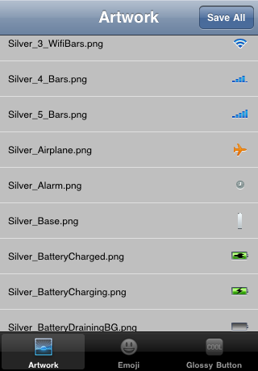
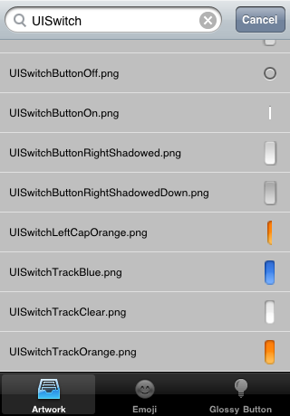
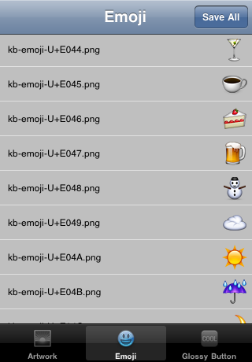
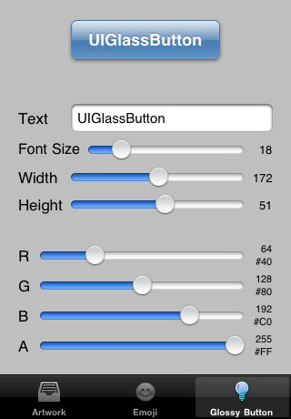

## iOS Artwork

*iOS Artwork Extractor* extracts all the artwork and emoji symbols contained in iOS into png files.

In order to extract *Retina Display @2x* high resolution images, choose the **Hardware > Device > iPhone 4** menu in the iPhone Simulator.

The png files are saved into a folder on your desktop.

## Glossy Buttons

*iOS Artwork Extractor* can also generate glossy buttons png files if you are using a simulator running **iOS 5.0 or older**. Thanks to [@schwa](http://twitter.com/schwa/status/9288691077) for the original code. Three states (normal/highlighted/disabled) glossy buttons png files are saved into the same directory as iOS artwork png files under the *UIGlassButton* subdirectory.

## IPAs

*iOS Artwork Extractor* also knows how to extract artwork from apps you downloaded from the App Store. It goes without saying that this is for educational purpose only and that you should not steal others' atwork.

## Screenshots

